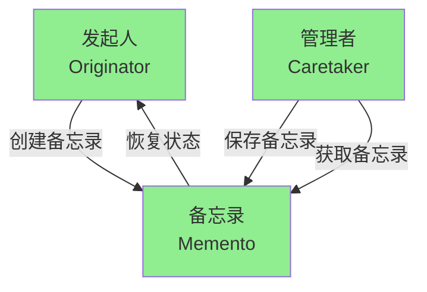

arkdown: Open Preview to the Side# 备忘录模式 (Memento Pattern)

## 模式结构图

## 模式说明

备忘录模式（Memento Pattern）是一种行为型设计模式，它允许在不破坏封装性的前提下，捕获一个对象的内部状态，并在该对象之外保存这个状态，以便以后可以将该对象恢复到之前保存的状态。

### 核心组件

1. **发起人 (Originator)**
   - 负责创建一个备忘录，用以记录当前时刻它的内部状态
   - 可以使用备忘录恢复内部状态

2. **备忘录 (Memento)**
   - 负责存储发起人的内部状态
   - 防止发起人之外的对象访问备忘录

3. **管理者 (Caretaker)**
   - 负责保存备忘录
   - 不能对备忘录的内容进行操作或检查

### 交互流程

- **创建备忘录**：Originator 创建 Memento 对象来保存当前状态
- **保存备忘录**：Caretaker 保存 Memento 对象
- **获取备忘录**：Caretaker 从存储中获取 Memento 对象
- **恢复状态**：Originator 使用 Memento 对象恢复之前的状态
